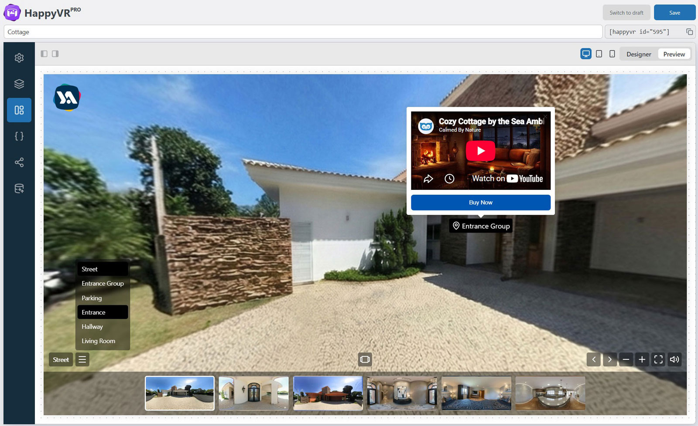

# HappyVR - Virtual Tour Builder & 360 Panorama Viewer

Create high-performance 360° virtual tours in minutes with a feature-rich,
React-powered builder optimized for smooth editing and fast loading.

## About this repository

This repository contains the **exact free version published on [WordPress.org](https://wordpress.org/plugins/happyvr/)** - the JS and CSS assets here are intentionally **not minified or obfuscated**, so you can read
and audit every line the plugin runs on your site. The Pro version is distributed separately via [yalogica.com](https://yalogica.com/happyvr/).

## Description

HappyVR is a WordPress plugin for building 360° virtual tours and interactive panorama viewers - no coding required. It runs on a modern React + Shadow DOM
architecture: blazing-fast loading, smooth instant editing, and zero CSS conflicts with your theme. Advanced Tile Generation slices panoramas into optimized tiles, so even gigapixel 360° images load instantly on mobile
devices.

- [Documentation](https://yalogica.com/docs/happyvr/)
- [Video Tutorials](https://www.youtube.com/playlist?list=PLJOWBe-G-MMM)
- [Upgrade to Pro](https://yalogica.com/happyvr/)

### Free version highlights

- Tours / scenes / layers: up to 5 each
- Tile generation (high quality) for gigapixel panoramas
- Mobile-responsive viewer, custom viewport background
- Virtual tour intro & background sound
- View limits (yaw, pitch, FOV)
- Markers (icon / text / image), tooltips and rich popups
- Layer animations, 100+ curated hotspot icons
- Embed code for external websites
- Controls: scene title, scene counter, nav arrows, scene list navigation, fullscreen toggle, adjustable zoom, global mute, loading indicator

**HappyVR Pro** adds unlimited tours, scenes and layers, plus advanced customization, auto load & auto rotate, greeting dialogs, drag & drop marker editing, custom JS & CSS, and a developer API for professional agencies and growing businesses.

## Installation

The canonical, always-up-to-date build lives in the WordPress.org directory:

1. In your WordPress admin, go to **Plugins → Add New**.
2. Search for "HappyVR".
3. Click **Install Now**, then **Activate**.

Or download the installable zip directly from [wordpress.org/plugins/happyvr](https://wordpress.org/plugins/happyvr/).

## Support

- **Usage & installation help:** use the [WordPress.org support forum](https://wordpress.org/support/plugin/happyvr/) - this is the fastest way to get an answer.
- **GitHub Issues:** for reproducible bugs in the source code published in this repository only.